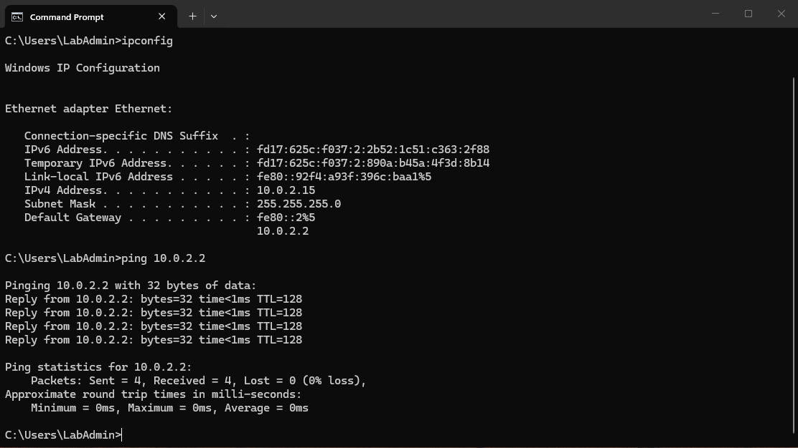
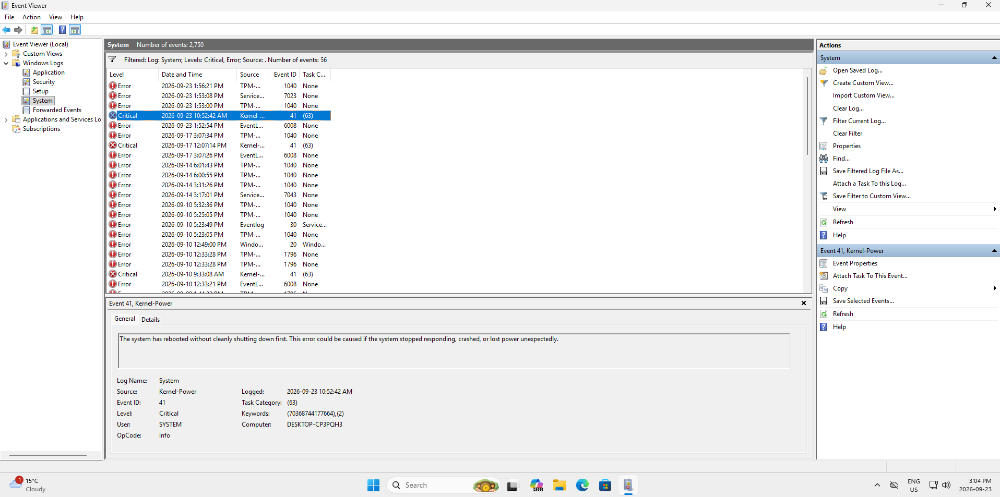
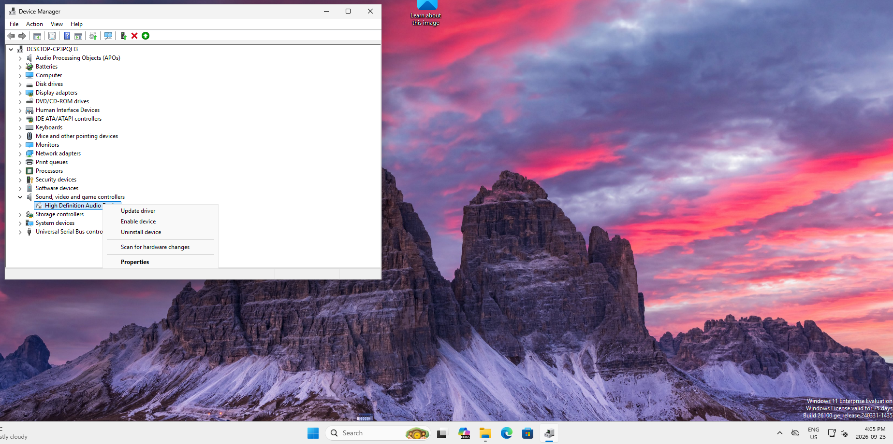

# Windows 11 Help Desk Troubleshooting Lab

Hands-on Windows 11 support portfolio demonstrating a structured Tier 1 troubleshooting workflow in a VirtualBox lab environment.

## Project Objective

Practice the same workflow used in entry-level Help Desk and Service Desk work:

1. Identify the user's symptom and impact.
2. Form a theory before making changes.
3. Gather evidence with low-risk diagnostics.
4. Apply a safe, reversible fix.
5. Verify the original issue is resolved.
6. Document findings, actions, and next steps.

## Skills Demonstrated

- Windows 11 troubleshooting
- TCP/IP, DHCP, DNS, gateway and ping testing
- Network adapter diagnosis
- NTFS permissions and standard-user access
- Windows Services
- Task Manager and application recovery
- Windows Update and storage review
- Event Viewer analysis
- Device Manager and audio troubleshooting
- Technical documentation and user-focused verification

## Troubleshooting Cases

| # | Case | Primary Tools | Result |
|---|---|---|---|
| 1 | DNS failure | `ipconfig`, `ping` | Connectivity/name resolution restored |
| 2 | Disabled/disconnected network adapter | Settings, network adapter tools, `ping` | Adapter and connectivity restored |
| 3 | Incorrect static IP | `ipconfig`, adapter settings | DHCP configuration restored |
| 4 | NTFS permission issue | File Explorer, Security, Advanced Security | Employee read access restored |
| 5 | Windows Search service | `services.msc` | Search service restored |
| 6 | Frozen application | Task Manager | Application recovered without rebooting PC |
| 7 | Performance / unexpected shutdown | Task Manager, Windows Update, Event Viewer | Evidence documented; Event 41 and 6008 correlated |
| 8 | Disabled audio device | Sound Settings, Device Manager | Disabled device identified and enabled |

## Evidence

See [`screenshots/`](screenshots/) for sanitized lab evidence. Screenshots are used to support the troubleshooting narrative, not as a substitute for explaining the diagnostic reasoning.

## Documentation

The full case-study document is included as:

- `Windows_11_Help_Desk_Troubleshooting_Portfolio.docx`
- `Windows_11_Help_Desk_Troubleshooting_Portfolio.pdf`

## Key Takeaway

The goal of this lab was not simply to click through Windows settings. It was to practice isolating a problem, explaining why each diagnostic step was chosen, making the least disruptive change, and verifying the result - the same reasoning expected in Tier 1 IT support.

## Troubleshooting Scenarios

### 1. Network Connectivity & DNS Troubleshooting

**Reported issue:** User was unable to access the internet.

**Troubleshooting process:**
- Verified physical network connections first.
- Checked the network adapter in Device Manager.
- Used `ipconfig` to review the computer's IP configuration.
- Used `ping` to test connectivity to the gateway and `8.8.8.8`.
- Identified that the network adapter was disabled.
- Enabled the adapter and retested connectivity.
- Verified successful communication after the fix.

**Result:** Network connectivity was successfully restored and verified through command-line testing.

---

### 2. Windows Unexpected Shutdown Investigation

**Reported issue:** Investigated an unexpected Windows shutdown.

**Troubleshooting process:**
- Opened Event Viewer and reviewed Windows System logs.
- Located critical **Kernel-Power Event ID 41**.
- Reviewed surrounding events to gather additional evidence.
- Identified **Event ID 6008**, confirming that the previous system shutdown was unexpected.
- Correlated the event information and timestamps before determining the next troubleshooting steps.

**Result:** Confirmed and documented evidence of an unexpected shutdown using Windows Event Viewer.

---

### 3. Audio Device Troubleshooting

**Reported issue:** User reported no sound from the computer.

**Troubleshooting process:**
- Verified physical speaker and audio connections.
- Checked Windows Sound settings and found that no output device was available.
- Opened Device Manager and located the High Definition Audio device.
- Determined that the device was disabled because the **Enable device** option was available.
- Enabled the device and verified audio functionality with the user.

**Result:** Identified the disabled audio device as the cause and restored audio functionality.

---

## Troubleshooting Methodology

Throughout the lab, I followed a structured Tier 1 support process:

**Identify → Investigate → Form a Theory → Test → Resolve → Verify → Document**

Rather than immediately making changes, I gathered evidence first using Windows Settings, Task Manager, Device Manager, Command Prompt, and Event Viewer.

## Tools Used

- Windows 11
- Oracle VirtualBox
- Command Prompt
- `ipconfig`
- `ping`
- Device Manager
- Event Viewer
- Task Manager
- Windows Settings

## What I Learned

This lab strengthened my ability to troubleshoot Windows issues systematically instead of guessing at solutions. I practiced separating symptoms from root causes, using built-in Windows diagnostic tools, verifying fixes, and documenting the troubleshooting process in a way that could be communicated to another technician.
